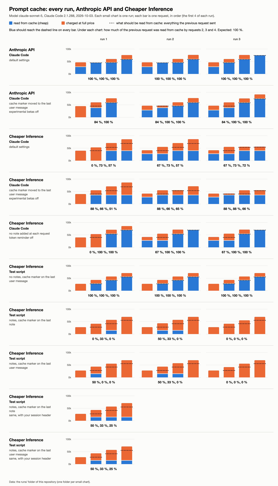

# Details: every run, how to read the numbers, caveats

Start with [`README.md`](README.md): it explains the problem and the words
used here (request, prompt cache, cache marker, note, token reminder). This
page is for the engineer who wants to check each claim against a file.

## How to read the numbers

Every response says how the tokens of the request were billed, in its `usage`
field:

| field in `usage` | what it means | price, compared with normal input |
|---|---|---|
| `cache_read_input_tokens` | read from cache: already seen in an earlier request | about 10 % |
| `cache_creation_input_tokens` | written to cache: new, and stored for the next request | about 125 % |
| `input_tokens` | neither read nor written: after the last cache marker | 100 % |

The three add up to everything the request sent. In a conversation that grows,
a working cache reads everything the previous request sent, and writes only
what was added since. So the figure we follow is: **how much of the previous
request did this request read from cache?** Expected: 100 %.

Three more words used below:

- **Upstream.** The provider that Cheaper Inference forwards a request to. The
  message id tells which one: `msg_bdrk_…` is Amazon Bedrock.
- **Affinity header.** `x-ci-prompt-cache-affinity`, a header of your
  responses. `hit` means your routing recognised the conversation, `new` means
  it did not.
- **Test script.** [`repro.py`](repro.py): a short script that sends a made-up
  conversation of four turns, with no Claude Code involved. It makes the
  problem visible with a few plain requests.

## All runs



2026-10-03, model `claude-sonnet-5`, Claude Code 2.1.288. Each folder of
[`runs/`](runs/) holds the full raw traffic of one run. The pictures show
requests 1 to 4 of each run; the table and the folders have all of them.

What each kind of run is:

- **Claude Code, default settings.** Claude Code as it ships. It adds a note
  after each step and puts the cache marker on the last note.
- **Claude Code, experimental betas off**
  (`CLAUDE_CODE_DISABLE_EXPERIMENTAL_BETAS=1`). Claude Code still adds the
  notes, but puts the cache marker on the last user message instead. This
  tests whether the place of the marker matters.
- **Claude Code, token reminder off** (`CLAUDE_CODE_TOTAL_TOKENS_REMINDER=off`).
  Claude Code no longer adds a note at each request; only the first note
  remains. This tests whether the notes are the cause.
- **Test script.** The same made-up conversation, sent three ways: without
  notes; with a note after each user message and the marker on the last note;
  with the same notes and the marker on the last user message.
- **Test script with the session header.** The two ways with notes, plus your
  header `x-ci-prompt-cache-session`.

<!-- results -->
| run folder | where | what runs | what differs | setting | read back from the previous request, request 2 onwards |
|---|---|---|---|---|---|
| [`claude-code_anthropic_1`](runs/claude-code_anthropic_1/) | Anthropic API | Claude Code | default settings | — | 100 %, 100 %, 100 %, 100 %, 100 %, 100 % |
| [`claude-code_anthropic_2`](runs/claude-code_anthropic_2/) | Anthropic API | Claude Code | default settings | — | 100 %, 100 %, 100 %, 100 %, 100 %, 100 % |
| [`claude-code_anthropic_3`](runs/claude-code_anthropic_3/) | Anthropic API | Claude Code | default settings | — | 100 %, 100 %, 100 %, 100 %, 100 % |
| [`claude-code-nobetas_anthropic_1`](runs/claude-code-nobetas_anthropic_1/) | Anthropic API | Claude Code | cache marker moved to the last user message | `CLAUDE_CODE_DISABLE_EXPERIMENTAL_BETAS=1` | 84 %, 100 % |
| [`claude-code-nobetas_anthropic_2`](runs/claude-code-nobetas_anthropic_2/) | Anthropic API | Claude Code | cache marker moved to the last user message | `CLAUDE_CODE_DISABLE_EXPERIMENTAL_BETAS=1` | 84 %, 100 %, 100 %, 100 %, 100 % |
| [`claude-code-nobetas_anthropic_3`](runs/claude-code-nobetas_anthropic_3/) | Anthropic API | Claude Code | cache marker moved to the last user message | `CLAUDE_CODE_DISABLE_EXPERIMENTAL_BETAS=1` | 84 %, 100 %, 100 % |
| [`claude-code_cheaperinference_1`](runs/claude-code_cheaperinference_1/) | Cheaper Inference | Claude Code | default settings | — | 0 %, 73 %, 57 % |
| [`claude-code_cheaperinference_2`](runs/claude-code_cheaperinference_2/) | Cheaper Inference | Claude Code | default settings | — | 67 %, 73 %, 57 % |
| [`claude-code_cheaperinference_3`](runs/claude-code_cheaperinference_3/) | Cheaper Inference | Claude Code | default settings | — | 67 %, 73 %, 72 %, 72 %, 71 % |
| [`claude-code-nobetas_cheaperinference_1`](runs/claude-code-nobetas_cheaperinference_1/) | Cheaper Inference | Claude Code | cache marker moved to the last user message | `CLAUDE_CODE_DISABLE_EXPERIMENTAL_BETAS=1` | 88 %, 66 %, 51 %, 42 %, 41 %, 41 % |
| [`claude-code-nobetas_cheaperinference_2`](runs/claude-code-nobetas_cheaperinference_2/) | Cheaper Inference | Claude Code | cache marker moved to the last user message | `CLAUDE_CODE_DISABLE_EXPERIMENTAL_BETAS=1` | 88 %, 66 %, 65 %, 51 %, 50 %, 41 % |
| [`claude-code-nobetas_cheaperinference_3`](runs/claude-code-nobetas_cheaperinference_3/) | Cheaper Inference | Claude Code | cache marker moved to the last user message | `CLAUDE_CODE_DISABLE_EXPERIMENTAL_BETAS=1` | 88 %, 88 %, 66 %, 65 %, 65 %, 64 % |
| [`claude-code-reminderoff_cheaperinference_1`](runs/claude-code-reminderoff_cheaperinference_1/) | Cheaper Inference | Claude Code | no note added at each request | `CLAUDE_CODE_TOTAL_TOKENS_REMINDER=off` | 0 %, 100 %, 100 %, 100 %, 100 % |
| [`claude-code-reminderoff_cheaperinference_2`](runs/claude-code-reminderoff_cheaperinference_2/) | Cheaper Inference | Claude Code | no note added at each request | `CLAUDE_CODE_TOTAL_TOKENS_REMINDER=off` | 67 %, 100 %, 100 %, 100 % |
| [`claude-code-reminderoff_cheaperinference_3`](runs/claude-code-reminderoff_cheaperinference_3/) | Cheaper Inference | Claude Code | no note added at each request | `CLAUDE_CODE_TOTAL_TOKENS_REMINDER=off` | 67 %, 100 %, 100 %, 100 %, 100 % |
| [`script_cheaperinference_1`](runs/script_cheaperinference_1/) | Cheaper Inference | Test script | no notes, cache marker on the last user message | — | 100 %, 100 %, 100 % |
| [`script_cheaperinference_2`](runs/script_cheaperinference_2/) | Cheaper Inference | Test script | no notes, cache marker on the last user message | — | 100 %, 100 %, 100 % |
| [`script_cheaperinference_3`](runs/script_cheaperinference_3/) | Cheaper Inference | Test script | no notes, cache marker on the last user message | — | 100 %, 100 %, 100 % |
| [`script_cheaperinference_1`](runs/script_cheaperinference_1/) | Cheaper Inference | Test script | notes, cache marker on the last note | — | 0 %, 33 %, 0 % |
| [`script_cheaperinference_2`](runs/script_cheaperinference_2/) | Cheaper Inference | Test script | notes, cache marker on the last note | — | 50 %, 33 %, 0 % |
| [`script_cheaperinference_3`](runs/script_cheaperinference_3/) | Cheaper Inference | Test script | notes, cache marker on the last note | — | 0 %, 0 %, 0 % |
| [`script_cheaperinference_1`](runs/script_cheaperinference_1/) | Cheaper Inference | Test script | notes, cache marker on the last user message | — | 50 %, 0 %, 0 % |
| [`script_cheaperinference_2`](runs/script_cheaperinference_2/) | Cheaper Inference | Test script | notes, cache marker on the last user message | — | 50 %, 33 %, 0 % |
| [`script_cheaperinference_3`](runs/script_cheaperinference_3/) | Cheaper Inference | Test script | notes, cache marker on the last user message | — | 0 %, 0 %, 0 % |
| [`script-sessionheader_cheaperinference_1`](runs/script-sessionheader_cheaperinference_1/) | Cheaper Inference | Test script | notes, cache marker on the last note | `x-ci-prompt-cache-session` header | 50 %, 33 %, 25 % |
| [`script-sessionheader_cheaperinference_1`](runs/script-sessionheader_cheaperinference_1/) | Cheaper Inference | Test script | notes, cache marker on the last user message | `x-ci-prompt-cache-session` header | 50 %, 33 %, 25 % |
<!-- /results -->

Things to know when reading the table:

- **Request 2 of a Cheaper Inference run often reads little or nothing.** In
  the default and token-reminder-off runs, the first request of the
  conversation went to a different upstream (message id `gen_…`; 7 provider
  attempts in `billing.txt`) than the next ones (`msg_bdrk_…`). Request 2
  cannot read what another upstream wrote. That is a separate routing issue.
  The cache problem described here is visible from request 3 on. In the runs
  with experimental betas off, every request went to Bedrock, and the problem
  is visible from request 2.
- **Request 1 may already read from cache.** It reads the tools and the start
  of the system prompt, cached by the run before it a few minutes earlier.
- **Anthropic with experimental betas off: 84 % on request 2, then 100 %.**
  In request 1 the first note comes after the cache marker, so it is written
  to the cache one request later. This is expected.
- **Login.** The Anthropic runs use a subscription login (Claude Code then
  asks for a 1-hour cache). The Cheaper Inference runs use an API key
  (5-minute cache).
- The test script has not run on the Anthropic API yet.

## What the numbers show

**1. On Cheaper Inference, the cache holds the tools, the system prompt and
the notes, and nothing else.**
Run `claude-code_cheaperinference_1`. Request `1c8e105e` has 1 note and
writes 38 985 tokens to the cache: 35 180 for the tools and system prompt,
3 805 for the first note. Request `0fd91ba0` has 2 notes and writes 39 022,
that is 38 985 + 37. After that, each request reads that amount and writes 37
more: the size of one token reminder. The conversation itself (14 153, then
29 903, then 45 017 tokens) is billed in full each time. Bedrock's own
figures, in the `message_stop` event of each response
(`amazon-bedrock-invocationMetrics`), give the same numbers
(`cacheWriteInputTokenCount: 39022`).

**2. The place of the cache marker does not matter.**
With experimental betas off, the marker is on the last user message. On
Anthropic this reads 100 % (runs `claude-code-nobetas_anthropic_*`). On
Cheaper Inference each request writes the whole conversation to the cache
(18 148, 33 884, 49 453 … 65 641 tokens in run
`claude-code-nobetas_cheaperinference_1`), and the next request still reads
only 35 180, the tools and system prompt.

**3. Without the note that arrives at each request, the cache works.**
With the token reminder off, Claude Code sends a single note, identical in
every request. Runs `claude-code-reminderoff_cheaperinference_*` read 100 %
from request 3 on, and the affinity header turns to `hit`. The note is still
moved (request 1 of each run leaves the 945-token user message out of the
cache), but a part that no longer grows no longer breaks anything.

This is a workaround, not the fix. The token reminder is only the note that
Claude Code happens to add at every request. The test script uses notes of its
own and fails the same way, so any message with `"role": "system"` added
during a conversation is affected. The setting is on by default and is not in
Claude Code's documentation.

**4. Without any note, the cache works.**
Test script, no notes: 100 % of each previous request read from cache.

**5. Your own affinity header agrees.**
It is `new` on every request of the default and betas-off Claude Code runs,
and of the test script with notes. It is `hit` on turns 2 to 4 of the test
script without notes, and from request 3 on in the token-reminder-off runs.
See `response_headers` in each `.response.json`.

**6. Your session header does not help: routing is not the cause.**
Run `script-sessionheader_cheaperinference_1` sends the test script with notes
and the header `x-ci-prompt-cache-session` (one stable value per
conversation). The affinity header turns to `hit` on turns 2 to 4, so your
routing recognises the conversation. The cache read stays stuck at the system
prompt, to the token: 13 829, 13 841, 13 853, exactly as without the header
(requests `39a0517a-9de2-4916-bd63-19cee191596f`,
`d400543c-a252-435c-acea-de6c079de809`, `ef537b41-4df2-458c-84d1-52d875c573a0`).

**7. Both upstreams fail, in different ways.**
Claude Code requests went to Bedrock (`msg_bdrk_…`): the read is stuck at the
tools, the system prompt and the notes. Test script requests went to an
upstream with `msg_01…` ids. There, with notes, consecutive requests are not
handled the same way:

- some cache only the system prompt and the notes (`b56291a7`: 13 828 read,
  24 written, 41 431 billed in full);
- others write everything except the last user message and read nothing, not
  even the system prompt, which has its own cache marker (`36cffa9b`,
  `ea71a816`: 0 read, 27 651 and 55 297 written).

That is where the 0 % of the test script rows come from. It looks as if each
of these requests reached a backend with an empty cache. It happened in the
runs of 09:17 to 09:27 UTC, not in the session-header run of 11:39 UTC.

## What a note looks like in a request

Claude Code announces these notes with the header
`anthropic-beta: mid-conversation-system-2026-04-07`. A note follows a user
message. By default the cache marker is on the last note:

```
{"role": "user",   "content": [{"type": "tool_result", ...}]},
{"role": "system", "content": [{"type": "text", "text": "(note from Claude Code)",
                                "cache_control": {"type": "ephemeral"}}]}
```

Claude Code sends the last note as a list of blocks (to carry the marker) and
as a plain string in later requests. The text is identical.

Anthropic's [documentation](https://platform.claude.com/docs/en/build-with-claude/mid-conversation-system-messages)
says such a note "is itself cacheable". It lists the feature as not available
on Claude Sonnet 5, while [AWS's page](https://docs.aws.amazon.com/bedrock/latest/userguide/claude-messages-mid-conversation-system.html)
lists Sonnet 5 as supported. In practice, the Anthropic API accepts these
requests with `claude-sonnet-5` and caches 100 % (runs above).

## A third possible fix

We tested this only against a local fake endpoint, not against a real API.
When the endpoint answers such a request with HTTP 400 and the message
`role 'system' is not supported on this model`, Claude Code 2.1.288 sends the
request again with the notes as text inside the user message, and sends no
more notes for the rest of the conversation. We have not confirmed that this
is the exact wording of the Anthropic API.

## The same problem in other gateways

LiteLLM published an [incident report](https://docs.litellm.ai/blog/bedrock-invoke-prompt-caching-incident)
on this exact behaviour (July 2026). A change moved every `"role": "system"`
message from the `messages` list into the top-level `system` field. For Claude
Code on Bedrock, "warm-session cache hit rates dropped from roughly 90% to
25-45% and team daily spend rose 2-3x for the same usage". Their fix keeps
these messages in place for the models that accept them. They note that one of
Bedrock's two APIs, Converse, refuses `system` messages inside `messages`, so
that path still has to move them; the other one, InvokeModel, accepts them.

Other gateways fixed the same thing, by keeping the note in place or by
turning it into user text in place:
LiteLLM [#41043](https://github.com/BerriAI/litellm/issues/41043) (Bedrock
Converse) and [#38053](https://github.com/BerriAI/litellm/pull/38053)
(Anthropic path), agentgateway [#3758](https://github.com/agentgateway/agentgateway/issues/3758),
Ollama [#18431](https://github.com/ollama/ollama/issues/18431). On the Claude
Code side: [anthropics/claude-code #90018](https://github.com/anthropics/claude-code/issues/90018).

## Inside each run folder

- `output.txt`: one line per request, with its request id
  (`x-ci-request-id` on Cheaper Inference, `request-id` on Anthropic), its
  message id, and for Claude Code its time.
- `requests/`: one pair of files per request, in order (`01`, `02`… for
  Claude Code; `user-turn1`…, `system-turn1`… and `notes-user-turn1`… for
  the three ways of the test script).
  - `….request.json`: the body sent.
  - `….response.json`: URL, request headers (key hidden), status, response
    headers, and the response (the raw event stream for Claude Code).
- `billing.txt` (Cheaper Inference runs): your usage record of each request
  id, read from `GET /v1/usage/requests`.
- `run.json` (Claude Code runs): provider, model, Claude Code version, settings.

In the Claude Code runs, a few values are hidden, listed in each file's
`redacted` field: device and session ids, an email address, and the text of
personal instruction files. In the published copy, Claude Code's own text
(system prompt, tool definitions, notes, the text blocks it adds to user
messages) and the text the model wrote in the responses are also replaced by
their length and a digest, so two identical texts keep the same digest; the
local permission context (`safeguards` field), thinking signatures, session
ids and quota headers are hidden. Roles, structure, tool calls, tool results,
usage and every cache marker are kept. The token counts come from the live
responses, not from a replay of these bodies.

## Reproduce

```
# the test script: Python 3 only, about 0.70 USD
API_KEY=<Cheaper Inference key> python3 repro.py cheaperinference
SESSION_HEADER=1 API_KEY=<Cheaper Inference key> python3 repro.py cheaperinference   # with x-ci-prompt-cache-session
API_KEY=<Anthropic API key> python3 repro.py anthropic

# real Claude Code (needs the `claude` command)
CI_API_KEY=<Cheaper Inference key> python3 claude-code-compare.py cheaperinference out-dir [--no-betas] [--reminder-off]
python3 claude-code-compare.py anthropic out-dir [--no-betas]          # normal Claude Code login
```
