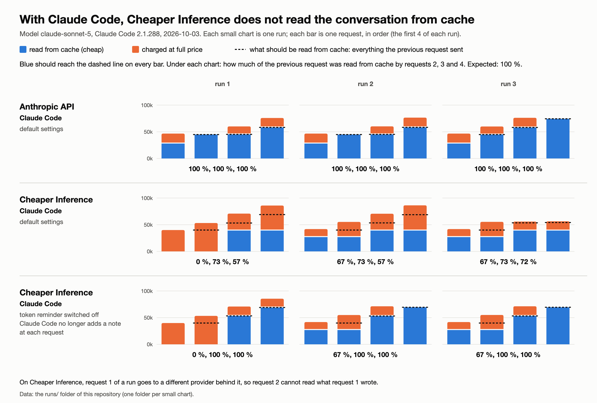

# With Claude Code, Cheaper Inference does not read the conversation from cache

Tested on 2026-10-03 with Claude Code 2.1.288 as it ships (no custom tool
around it) and the model `claude-sonnet-5`.

## In three sentences

1. **The problem.** With Claude Code, the Anthropic API reads the whole
   conversation from cache at every request. Cheaper Inference only reads the
   fixed beginning, and bills the rest of the conversation in full, every time.
2. **The likely cause.** Claude Code adds short notes of its own inside the
   conversation. On Cheaper Inference these notes do not stay where Claude
   Code put them: they end up before the conversation. A new note arrives with
   each request, so the start of the request changes each time, and the cache
   only works on a start that does not change.
3. **The evidence.** When we switch off the note that Claude Code adds at each
   request, the same task reads 100 % from cache on Cheaper Inference.

## The words used on this page

- **Request.** Every step Claude Code takes (a tool call, an answer) is one
  request to the API. Each request carries the whole conversation so far.
- **Prompt cache.** When a request starts exactly like an earlier one, the
  provider reuses what it already processed and bills that part about ten
  times cheaper. Only an identical start counts: one change near the top, and
  everything after it is billed in full.
- **Cache marker.** The field `cache_control`, which Claude Code puts on a
  message to say "cache everything up to here".
- **Note.** A short message that Claude Code inserts in the conversation by
  itself. It is written neither by the user nor by the model; its `role` is
  `system`. The first note describes the working environment.
- **Token reminder.** The note Claude Code adds after each step, to tell the
  model how many tokens it has left. It is the note that arrives at each
  request.

## The picture



The same small task (read four files, one per request), run three times in
each case. Each bar is one request. Blue is what was read from cache, orange is
what was billed in full. The dashed line is what should be blue: everything the
previous request sent.

- **Line 1, Anthropic API**: blue reaches the dashed line. The cache works.
- **Line 2, Cheaper Inference**: blue stays at the same height while the
  conversation grows. Only the fixed beginning is read from cache.
- **Line 3, Cheaper Inference with the token reminder switched off**: blue
  reaches the dashed line again from request 3 on.

## What seems to happen

Here is the third request of a conversation, as Claude Code sends it and as it
seems to reach the model behind Cheaper Inference. We cannot see your side, so
the right-hand column is our reading of the numbers, not a fact.

```
What Claude Code sends                    What seems to reach the model
--------------------------------------    --------------------------------------
tools and system prompt                   tools and system prompt
user:      the task                       note 1 (environment)
note 1     (environment)                  note 2 (tokens left)
assistant: calls a tool                   note 3 (tokens left)   <- new at each request
user:      the tool's result              user:      the task
note 2     (tokens left)                  assistant: calls a tool
assistant: calls a tool                   user:      the tool's result
user:      the tool's result              assistant: calls a tool
note 3     (tokens left)  <- cache marker user:      the tool's result
```

On the left, each request only adds lines at the bottom: the start never
changes, so the cache works. On the right, each request inserts one more note
near the top: everything below it no longer matches the previous request.

## The raw request you asked for

[`07.request.json`](runs/claude-code_cheaperinference_1/requests/07.request.json)
is the third request of a Claude Code conversation on Cheaper Inference
(request id `7a49e057-7764-4074-948f-64d5d7ef13e5`,
[your response](runs/claude-code_cheaperinference_1/requests/07.response.json)).
Its messages, and where the cache markers are:

```
system[1]                                                    cache marker
system[2]                                                    cache marker
messages[0]  user       the task
messages[1]  system     note: "# Environment …"
messages[2]  assistant  calls a tool
messages[3]  user       the tool's result
messages[4]  system     note: "… tokens left"
messages[5]  assistant  calls a tool
messages[6]  user       the tool's result
messages[7]  system     note: "… tokens left"                cache marker   <- the last message
```

So the last message is marked, as Claude Code always does. What is new in
recent versions is that this last message is a note.

What your response says about that request:

| | tokens |
|---|---|
| sent by the previous request, so expected from cache | 53 175 |
| read from cache | 39 022 (the tools, the system prompt and the first two notes) |
| written to cache | 37 (the new note) |
| billed in full | 29 903 (the conversation) |

## The simplest proof: one request

A test script, with no Claude Code involved, sends a single request: a system
prompt, one user message, then one note that carries the cache marker
([`system-turn1.request.json`](runs/script_cheaperinference_1/requests/system-turn1.request.json),
request id `6e2992e3-113e-4030-815d-7a2d9f8bb62b`). Everything before the
marker should be written to the cache.

| | written to cache | billed in full |
|---|---|---|
| expected | 27 635 (everything) | 2 |
| [received](runs/script_cheaperinference_1/requests/system-turn1.response.json) | 13 828 (the system prompt and the note) | 13 809 (the user message) |

The user message was sent before the note, and it was left out of the cache.
So, for the model, the note came before the user message.

## What we ask

1. Do you move these notes (messages with `"role": "system"` inside
   `messages`), or their cache marker, before forwarding the request?
2. Could you leave them where Claude Code puts them? If the model behind
   cannot accept them there, turning each note into a piece of text at the end
   of the user message before it has the same effect. Either way the start of
   the request stays identical from one request to the next.
3. Is there a request header that turns this off today? We tried
   `x-ci-prompt-cache-session`: it does not help (see [`DETAILS.md`](DETAILS.md)).

## Until it is fixed

A Claude Code user can switch the token reminder off with the environment
variable `CLAUDE_CODE_TOTAL_TOKENS_REMINDER=off`. Only the first note remains;
it never changes, so the cache works again (line 3 of the picture).

This hides the problem, it does not fix it: any other note that Claude Code
adds during a conversation breaks the cache again. The setting is not in
Claude Code's documentation; it is described in
[anthropics/claude-code #90018](https://github.com/anthropics/claude-code/issues/90018).

## Reproduce

```
# the test script: Python 3 only, about 0.70 USD
API_KEY=<Cheaper Inference key> python3 repro.py cheaperinference

# real Claude Code, same task as the picture (needs the `claude` command)
CI_API_KEY=<Cheaper Inference key> python3 claude-code-compare.py cheaperinference out-dir
CI_API_KEY=<Cheaper Inference key> python3 claude-code-compare.py cheaperinference out-dir --reminder-off
```

## More

- [`DETAILS.md`](DETAILS.md): every run, how to read each number, caveats, and
  the same problem in other gateways.
- [`runs/`](runs/): the raw requests, responses, request ids and usage records
  of every run.

In the published copy of the Claude Code runs, Claude Code's own text (system
prompt, tool definitions, notes) is replaced by its length and a digest. Roles,
structure and every cache marker are kept.
